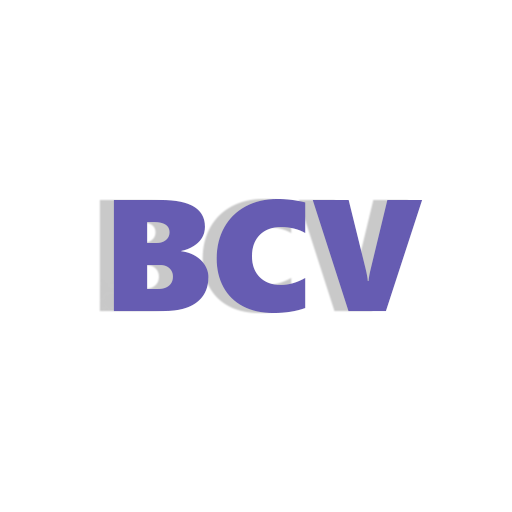

<a name="readme-top"></a>
<!--
*** Adapted from https://github.com/othneildrew/Best-README-Template/blob/master/README.md
-->

[![MIT License][license-shield]][license-url]
[![LinkedIn][linkedin-shield]][linkedin-url]


<!-- PROJECT LOGO -->
<br />
<div align="center">
  <a href="https://github.com/othneildrew/Best-README-Template">
    
  </a>

  <h3 align="center">Bryan Portfolio</h3>

  <p align="center">
    This is my personal portfolio, where I show my professional career!
  </p>
</div>


<!-- TABLE OF CONTENTS -->
<details>
  <summary>Table of Contents</summary>
  <ol>
    <li>
      <a href="#about-the-project">About The Project</a>
      <ul>
        <li><a href="#built-with">Built With</a></li>
      </ul>
    </li>
    <li>
      <a href="#getting-started">Getting Started</a>
      <ul>
        <li><a href="#prerequisites">Prerequisites</a></li>
        <li><a href="#installation">Installation</a></li>
      </ul>
    </li>
    <li><a href="#license">License</a></li>
    <li><a href="#contact">Contact</a></li>
    <li><a href="#acknowledgments">Acknowledgments</a></li>
  </ol>
</details>


<!-- ABOUT THE PROJECT -->
## About The Project

[![BCV Screenshot][bcv-screenshot]](/public/main_projects/bcv_screenshot.gif)

Live preview: [https://cv.bryanscduran.dev/](https://cv.bryanscduran.dev/)

<p align="right">(<a href="#readme-top">back to top</a>)</p>

### Built With

* [![React][React.js]][React-url]
* [![Typescript][Typescript]][Typescript-url]
* [![ChakraUI][ChakraUI]][ChakraUI-url]

<p align="right">(<a href="#readme-top">back to top</a>)</p>


<!-- GETTING STARTED -->
## Getting Started

Setting up your project locally.

### Prerequisites
  
* yarn
  ```sh
  npm install --global yarn
  ```

### Installation

1. Clone the repo
   ```sh
   git clone https://github.com/BryanSCD/Bryan-Portfolio.git
   ```
2. Ininitialize yarn
   ```sh
   yarn
   ```
3. Run
   ```js
   yarn dev
   ```

<p align="right">(<a href="#readme-top">back to top</a>)</p>

<!-- LICENSE -->
## License

Distributed under the MIT License. See `LICENSE.md` for more information.

<p align="right">(<a href="#readme-top">back to top</a>)</p>

<!-- CONTACT -->
## Contact

Bryan Smith Collazos Duran - bryanscduran@gmail.com

<p align="right">(<a href="#readme-top">back to top</a>)</p>


<!-- ACKNOWLEDGMENTS -->
## Acknowledgments

* [Cloud textures](https://resourceboy.com/)
* [UFO texture](https://pixabay.com/illustrations/ufo-extraterrestrial-space-5118239/)
* [Madrid Landscape](https://www.instagram.com/jaime_mad01/)
* [Avatar](https://readyplayer.me/)

<p align="right">(<a href="#readme-top">back to top</a>)</p>


<!-- MARKDOWN LINKS & IMAGES -->
<!-- https://www.markdownguide.org/basic-syntax/#reference-style-links -->
[contributors-shield]: https://img.shields.io/github/contributors/othneildrew/Best-README-Template.svg?style=for-the-badge
[contributors-url]: https://github.com/othneildrew/Best-README-Template/graphs/contributors
[license-shield]: https://img.shields.io/github/license/othneildrew/Best-README-Template.svg?style=for-the-badge
[license-url]: https://github.com/BryanSCD/Bryan-Portfolio/blob/master/LICENSE.md
[linkedin-shield]: https://img.shields.io/badge/-LinkedIn-black.svg?style=for-the-badge&logo=linkedin&colorB=555
[linkedin-url]: https://www.linkedin.com/in/bryansduran/
[bcv-screenshot]: /public/main_projects/bcv_screenshot.gif
[React.js]: https://img.shields.io/badge/React-20232A?style=for-the-badge&logo=react&logoColor=61DAFB
[React-url]: https://reactjs.org/
[Typescript]: https://shields.io/badge/TypeScript-3178C6?logo=TypeScript&logoColor=FFF&style=flat-square
[Typescript-url]: https://www.typescriptlang.org/
[ChakraUI]: https://shields.io/badge/chakra--ui-black?logo=chakraui&style=for-the-badge%22
[ChakraUI-url]: https://chakra-ui.com/
